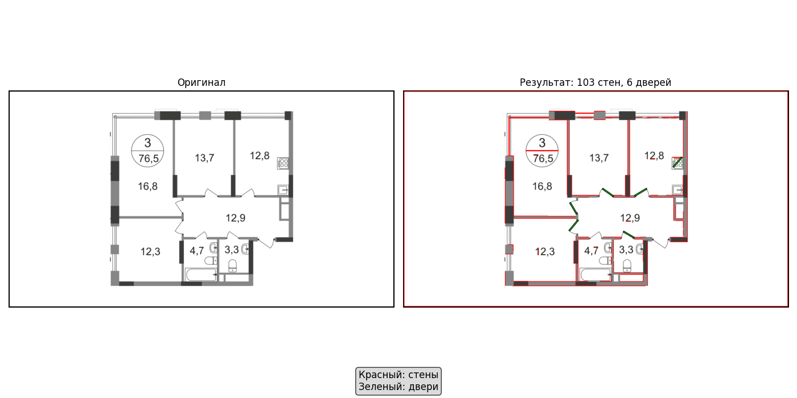

# Парсер архитектурных планов

Прототип системы для извлечения геометрии стен и дверей из изображений планов квартир с использованием компьютерного зрения.

## Цель проекта

Преобразовать изображения архитектурных планов в структурированный JSON формат для последующего использования в 2D/3D приложениях.

## Технологический стек и обоснование выбора

- **OpenCV**: Классические алгоритмы компьютерного зрения
- **NumPy**: Математические операции и обработка массивов
- **Matplotlib**: Визуализация результатов

**Почему выбран классический CV подход вместо нейросетей:**

1. **Прозрачность и контроль**: Каждый этап обработки полностью контролируем
2. **Отсутствие необходимости в обучении**: Не требуется размеченный датасет
3. **Быстрота работы**: Обработка изображения занимает <1 секунды
4. **Эффективность на чертежах**: Линии на архитектурных планах обычно четкие и прямые
5. **Интерпретируемость**: Легко понять, почему алгоритм нашел те или иные элементы

## Пайплайн обработки

### Этап 1: Предобработка изображения
- Конвертация в градации серого
- Улучшение контраста (CLAHE)
- Автоматическая бинаризация (метод Оцу)

### Этап 2: Детекция стен
- Детекция краев (алгоритм Canny)
- Поиск линий (Probabilistic Hough Transform)
- Фильтрация по длине и углу
- Классификация линий на горизонтальные, вертикальные и диагональные

### Этап 3: Детекция дверей (дополнительный функционал)
- Поиск коротких диагональных линий
- Проверка примыкания к обнаруженным стенам
- Определение направления открытия
- Фильтрация дубликатов

### Этап 4: Формирование результата
- Структурирование данных в JSON формат
- Сохранение с метаинформацией
- Визуализация результатов

## Структура выходных данных

```json
{
  "meta": {
    "source": "plan_01.png",
    "image_size": {
      "width": 1200,
      "height": 800
    }
  },
  "walls": [
    {
      "id": "w1",
      "points": [[100, 100], [300, 100]],
      "length": 200.0,
      "angle": 0.0,
      "type": "horizontal"
    }
  ],
  "doors": [
    {
      "id": "d1",
      "bbox": [150, 95, 30, 10],
      "points": [[150, 95], [155, 105], [180, 100], [175, 90]],
      "endpoints": [[155, 100], [175, 95]],
      "angle": 45.0,
      "length": 28.28,
      "wall_type": "horizontal",
      "direction": "right",
      "type": "door"
    }
  ]
}
```

## Примеры получающейся разметки:




## Установка и запуск

### Требования
- Python 3.8+
- Установленные зависимости из requirements.txt

### Установка зависимостей

```bash
pip install -r requirements.txt
```

### Запуск обработки

1. Поместите изображения планов в папку `plans/`
2. Запустите основной скрипт:

```bash
python main.py
```

3. Для визуализации результатов:

```bash
python visualization.py
```

## Пример использования

```python
from floorplan_parser import FloorplanParser

# Создание парсера
parser = FloorplanParser()

# Обработка изображения
result = parser.process("plans/sample_plan.png")

# Сохранение результата
import json
with open("output/plan.json", "w") as f:
    json.dump(result, f, indent=2)
```

## Ограничения и слабые места

1. **Требования к качеству изображений**:
   - Работает лучше всего с четкими цифровыми чертежами
   - Может терять линии на сканах низкого качества

2. **Геометрические предположения**:
   - Предполагает, что стены представлены прямыми линиями
   - Ожидает, что двери - это короткие диагональные линии

3. **Параметры алгоритмов**:
   - Параметры подобраны для типовых планов
   - Могут потребовать настройки для нестандартных случаев

4. **Неподдерживаемые случаи**:
   - Изогнутые стены
   - Перспективные искажения
   - Перекрывающиеся элементы

5. **Проблемы с ложными срабатываниями**:
  - Цифры размеров (например, "240", "1500") могут определяться как короткие линии-стены
  - Текст и символы на плане могут интерпретироваться как архитектурные элементы
  - Шумы и артефакты сканирования создают ложные линии

6. **Зависимость между компонентами**:
  - Обнаружение дверей зависит от правильной детекции стен (проверка примыкания)
  - Ошибки в определении стен приводят к пропуску или ложному определению дверей
  - Нет взаимной проверки целостности плана (комнаты, углы)

## План улучшений для следующей итерации

1. **Интеграция нейросетевых подходов**:
   - Добавление UNet для сегментации стен
   - Использование YOLO для детекции сложных элементов
   - Применение Tesseract OCR для распознавания размеров

2. **Улучшение геометрического анализа**:
   - Объединение коллинеарных отрезков в единые стены
   - Построение полигонов комнат
   - Проверка топологической корректности плана

3. **Расширение функциональности**:
   - Детекция окон и проемов
   - Распознавание мебели и оборудования
   - Экспорт в форматы DXF и SVG

4. **Обработка сложных случаев**:
   - Автоматическая коррекция перспективы
   - Удаление шумов и артефактов
   - Поддержка цветных планов

## Структура проекта

```
.
├── floorplan_parser.py       # Основной класс парсера
├── main.py                   # Точка входа для пакетной обработки
├── visualization.py          # Визуализация результатов
├── requirements.txt          # Зависимости Python
├── README.md                 # Документация
├── wall_door_detection.ipynb # Ноутбук разработки
├── plans/                    # Входные изображения
├── output/                   # Выходные JSON файлы
└── examples/                 # Примеры результатов
```
