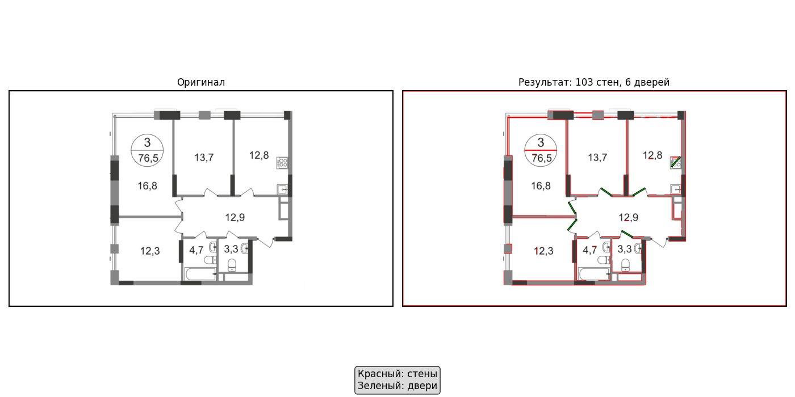

# Architectural Floor Plan Parser

A prototype system for extracting the geometry of walls and doors from images of apartment floor plans using computer vision.

## Project Goal

Convert images of architectural floor plans into a structured JSON format for subsequent use in 2D/3D applications.

## Technology Stack and Rationale for Selection

* **OpenCV**: Classical computer vision algorithms
* **NumPy**: Mathematical operations and array processing
* **Matplotlib**: Visualization of results

## Project Structure

```text
.
├── floorplan_parser.py       # Main parser class
├── main.py                   # Entry point for batch processing
├── visualization.py          # Visualization of results
├── requirements.txt          # Python dependencies
├── README.md                 # Documentation
├── wall_door_detection.ipynb # Development notebook
├── plans/                    # Input images
├── output/                   # Output JSON files
└── examples/                 # Examples of results
```

**Why a classical CV approach was chosen instead of neural networks:**

1. **Transparency and control**: Every processing step is fully controllable
2. **No need for training**: No labeled dataset is required
3. **Processing speed**: Image processing takes <1 second
4. **Efficiency on drawings**: Lines in architectural floor plans are usually clear and straight
5. **Interpretability**: It is easy to understand why the algorithm detected certain elements

## Processing Pipeline

### Stage 1: Image Preprocessing

* Conversion to grayscale
* Contrast enhancement (CLAHE)
* Automatic binarization (Otsu's method)

### Stage 2: Wall Detection

* Edge detection (Canny algorithm)
* Line detection (Probabilistic Hough Transform)
* Filtering by length and angle
* Classification of lines into horizontal, vertical, and diagonal

### Stage 3: Door Detection (Additional Functionality)

* Detection of short diagonal lines
* Checking adjacency to detected walls
* Determining the opening direction
* Duplicate filtering

### Stage 4: Result Generation

* Structuring data in JSON format
* Saving with metadata
* Visualization of results

## Output Data Structure

```json
{
  "meta": {
    "source": "plan_01.png",
    "image_size": {
      "width": 1200,
      "height": 800
    }
  },
  "walls": [
    {
      "id": "w1",
      "points": [[100, 100], [300, 100]],
      "length": 200.0,
      "angle": 0.0,
      "type": "horizontal"
    }
  ],
  "doors": [
    {
      "id": "d1",
      "bbox": [150, 95, 30, 10],
      "points": [[150, 95], [155, 105], [180, 100], [175, 90]],
      "endpoints": [[155, 100], [175, 95]],
      "angle": 45.0,
      "length": 28.28,
      "wall_type": "horizontal",
      "direction": "right",
      "type": "door"
    }
  ]
}
```

## Examples of Resulting Annotations:



## Installation and Usage

### Requirements

* Python 3.8+
* Dependencies from requirements.txt

### Installing Dependencies

```bash
pip install -r requirements.txt
```

### Running the Processing

1. Place floor plan images in the `plans/` folder
2. Run the main script:

```bash
python main.py
```

3. To visualize the results:

```bash
python visualization.py
```

## Usage Example

```python
from floorplan_parser import FloorplanParser

# Create parser
parser = FloorplanParser()

# Process image
result = parser.process("plans/sample_plan.png")

# Save result
import json
with open("output/plan.json", "w") as f:
    json.dump(result, f, indent=2)
```

## Limitations and Weak Points

1. **Image quality requirements**:

   * Works best with clear digital drawings
   * May lose lines in low-quality scans

2. **Geometric assumptions**:

   * Assumes that walls are represented by straight lines
   * Expects doors to be short diagonal lines

3. **Algorithm parameters**:

   * Parameters are selected for typical floor plans
   * May require tuning for non-standard cases

4. **Unsupported cases**:

   * Curved walls
   * Perspective distortions
   * Overlapping elements

5. **False-positive issues**:

   * Dimension numbers (for example, "240", "1500") may be detected as short wall lines
   * Text and symbols on the plan may be interpreted as architectural elements
   * Noise and scanning artifacts create false lines

6. **Dependency between components**:

   * Door detection depends on correct wall detection (adjacency check)
   * Errors in wall detection lead to missed or false door detection
   * There is no mutual integrity check of the floor plan (rooms, angles)

## Improvement Plan for the Next Iteration

1. **Integration of neural network approaches**:

   * Add UNet for wall segmentation
   * Use YOLO for detection of complex elements
   * Apply Tesseract OCR for dimension recognition

2. **Improvement of geometric analysis**:

   * Merge collinear segments into unified walls
   * Build room polygons
   * Check topological correctness of the floor plan

3. **Functionality Expansion**:

   * Window and opening detection
   * Furniture and equipment recognition
   * Export to DXF and SVG formats

4. **Handling Complex Cases**:

   * Automatic perspective correction
   * Noise and artifact removal
   * Support for color floor plans
